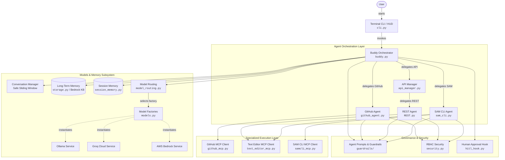

# 🤖 BUDDY AGENT

<div align="center">

[](https://www.python.org/)
[](https://github.com/strands-agents)
[](https://modelcontextprotocol.io/)
[](https://groq.com/)
[](https://ollama.com/)
[](https://aws.amazon.com/bedrock/)

**Autonomous AI Pair Programmer & Infrastructure Orchestrator**  
*Deep Multi-Agent Delegation • Zero-Hardcoded MCP Tools • Project I.G.I. Tactical HUD • Btop++ Telemetry*

</div>

---

## 📑 Table of Contents

- [Overview](#-overview)
- [System Architecture](#-system-architecture)
- [Multi-Agent Topology](#-multi-agent-topology)
- [Dynamic Model Routing & BYOM](#-dynamic-model-routing--bring-your-own-model-byom)
- [Model Context Protocol (MCP) Tools](#-model-context-protocol-mcp-tools)
- [Memory & State Persistence](#-memory--state-persistence)
- [Tactical HUD & Btop++ Telemetry](#-tactical-hud--btop-telemetry)
- [Security, RBAC & Governance](#-security-rbac--governance)
- [Installation & Quickstart](#-installation--quickstart)
- [CLI Reference & Hotkeys](#-cli-reference--hotkeys)
- [Project Structure](#-project-structure)
- [Environment Configuration](#-environment-configuration)

---

## 🌟 Overview

**Buddy Agent** is an autonomous agentic AI pair programmer built with Python 3.14 and the **Strands Agents** framework. It bridges high-level developer intent with production infrastructure by combining:

- **Multi-Agent Orchestration**: Master orchestrator dynamically delegating to specialized micro-agents (`API Manager`, `REST API Agent`, `GitHub Agent`, and `SAM CLI Agent`).
- **Dynamic Model Assignment**: Per-agent model routing across **Groq Cloud** LPUs, **Ollama** local open weights, **AWS Bedrock** Claude 3.7, and custom **Bring Your Own Model (BYOM)** configurations.
- **Model Context Protocol (MCP)**: Native integration with GitHub MCP, AWS SAM CLI MCP, and atomic Text Editor MCP with zero hardcoded tools.
- **Dual-Tier Memory**: Resilient session archiving with UUID hot-swapping and AWS Bedrock Knowledge Base semantic long-term memory.
- **Tactical Retro HUD**: Project I.G.I.-inspired terminal interface with real-time **Btop++** CPU braille curves, RSS memory meters, network I/O, and AI sonar radar.

---

## 🏗️ System Architecture



---

## 🤖 Multi-Agent Topology

Buddy Agent implements a hierarchical delegation tree where each agent is constrained to its domain with strict system guardrails and dedicated MCP tool interfaces:

```text
Buddy Orchestrator (Master Planner & Intent Classifier)
 ├── API Manager (REST Endpoint Design & Schema Generator)
 │    └── REST Agent (FastAPI / Route Implementation & Text Editor MCP)
 ├── GitHub Agent (Issue Tracking, PR Lifecycles & Branch Management)
 └── SAM CLI Agent (CloudFormation Packaging, Local Emulation & Deployments)
```

### Agent Responsibilities

| Agent | Module | Role & Responsibilities | Tools / MCP Used |
| :--- | :--- | :--- | :--- |
| **Buddy Orchestrator** | `buddy.py` | Top-level intent classification, multi-step execution planning, context synthesis, human escalation. | `call_api_manager`, `call_sam_cli_agent`, `call_github_agent` |
| **API Manager** | `api_manager.py` | Architects microservice route structure, request/response models, and Pydantic validation schemas. | `call_rest_agent` |
| **REST Agent** | `REST.py` | Writes, modifies, and patches FastAPI/Python code files deterministically. | `Text Editor MCP`, `GitHub REST MCP` |
| **GitHub Agent** | `github_agent.py` | Manages git repositories, commits, branches, issues, and pull request workflows. | `GitHub MCP` |
| **SAM CLI Agent** | `sam_cli.py` | Builds, validates, packages, and deploys serverless CloudFormation stacks to AWS. | `SAM CLI MCP`, `Text Editor MCP` |

---

## 🧠 Dynamic Model Routing & Bring Your Own Model (BYOM)

Buddy Agent features an LLM router supporting provider-level switching, exact model selection, and **per-agent independent model assignment**.

### Supported Satellite Catalogs

| Provider | Default Model | Available Predefined Models | BYOM Custom Format |
| :--- | :--- | :--- | :--- |
| **Groq Cloud** | `qwen/qwen3.8-27b` | • `qwen/qwen3.8-27b`<br>• `openai/gpt-oss-120b`<br>• `meta-llama/llama-prompt-guard-2-22m` | `groq:<custom-model-id>` |
| **Ollama Local** | `llama3.1:8b` | • `llama3.1:8b`<br>• `qwen:7b`<br>• `qwen2.5-coder:32b` | `ollama:<custom-model-id>` |
| **AWS Bedrock** | `Claude 3.7 Sonnet` | • `us.anthropic.claude-3-7-sonnet-20250219-v1:0` | `bedrock:<custom-model-id>` |

### Multi-Agent Model Configuration Example

Users can assign different models to each sub-agent simultaneously:
- **Buddy Orchestrator**: `Groq Cloud (Qwen 3.8 27B)` for ultra-fast planning.
- **REST API Agent**: `Ollama Local (Qwen 2.5 Coder 32B)` for high-precision code synthesis.
- **GitHub Agent**: `Groq Cloud (GPT-OSS 120B)` for nuanced PR reviews.
- **SAM CLI Agent**: `AWS Bedrock (Claude 3.7 Sonnet)` for complex CloudFormation infrastructure.

---

## 🛠️ Model Context Protocol (MCP) Tools

Buddy Agent integrates with external systems via MCP clients, ensuring zero hardcoded tool execution:

| 🐙 GitHub MCP Tools | ⚡ SAM CLI MCP Tools | 📝 Text Editor MCP Tools |
| :--- | :--- | :--- |
| • `create_pull_request` | • `sam deploy` | • `delete_text_file_contents` |
| • `merge_pull_request` | • `sam sync` | • `undo_text_file_contents` |
| • `create_issue` | • `sam delete` | • `list_directory_contents` |
| • `list_issues` | • `sam package` | • `move_text_file` |
| • `get_issue` | • `sam validate` | • `copy_text_file` |
| • `update_issue` | • `sam logs` | • `view_file_contents` |
| • `add_issue_comment` | • `sam list` | • `create_or_update_file` |
| • `create_branch` | • `sam pipeline init` | • `replace_file_content` |
| • `list_branches` | • `sam traces` | • `multi_replace_file_content` |
| • `create_commit` | • `sam init` | |
| • `fork_repository` | | |

---

## 💾 Memory & State Persistence

Buddy Agent provides a multi-tiered memory architecture designed for long-running workflows:

1. **Session UUID Memory (`FileSessionManager` / `S3SessionManager`)**:
   - Each session is identified by a UUID.
   - All conversation turns, agent messages, model selections, and sub-agent mappings are persisted to `./agent/memory/sessions_data/session_<UUID>/session.json`.
   - Resume any previous conversation state by pasting or providing the session UUID.
2. **Safe Sliding Window Compression**:
   - `SafeSlidingWindowConversationManager` prevents context window overflow while preserving critical system prompts and tool schemas.
3. **Long-Term Memory Store**:
   - Integrated with **AWS Bedrock Knowledge Base** for semantic RAG and vector-indexed past conversation memories.

---

## 🎮 Tactical HUD & Btop++ Telemetry

Inspired by **Project I.G.I.** and modern terminal monitors (**btop++**), the interactive UI provides:

- **Project I.G.I. Tactical Navigation**: 3D extruded borders, CRT phosphor green styling, mission briefing manuals, and end credits.
- **Live Btop++ Telemetry**:
  - Per-core CPU utilization curves rendered with Braille characters (`⣾`, `⣽`, `⣿`).
  - RSS memory bar graphs, swap metrics, and network I/O packet rates.
  - Interactive process tree inspection with kill / filter capabilities.
  - 360° AI Sonar Radar scanning active background threads.

---

## 🔒 Security, RBAC & Governance

- **Human-in-the-Loop (HITL) Hook (`hitl_hook.py`)**: Destructive actions (e.g. file deletions, `sam delete`, PR merges) prompt for explicit developer confirmation before tool execution.
- **Role-Based Access Control (RBAC)**: Enforces permission boundaries across agents to prevent unauthorized environment modifications.
- **OpenTelemetry & LangSmith Tracing**: Full distributed tracing of all model prompts, token usage, tool invocations, and latency metrics.

---

## 🚀 Installation & Quickstart

### Prerequisites

- **Python**: `>= 3.14`
- **Package Manager**: [`uv`](https://github.com/astral-sh/uv) (recommended) or `pip`
- **Ollama** (optional, for local models): [https://ollama.com](https://ollama.com)

### 1. Clone & Install Dependencies

```bash
git clone https://github.com/BenjaminVijayaraj5102004/Buddy-agent.git
cd Buddy-agent

# Install dependencies with uv
uv sync
```

### 2. Configure Environment Variables

Copy `.env.example` to `.env` and configure your API keys:

```bash
cp .env.example .env
```

```env
# GitHub Configuration
GITHUB_PAT="your-github-personal-access-token"

# Ollama Local Configuration
OLLAMA_BASE_URL="http://localhost:11434"
OLLAMA_MODEL_ID="llama3.1:8b"

# Groq Cloud Configuration
GROQ_API_KEY="your-groq-api-key"
GROQ_MODEL_ID="qwen/qwen3.8-27b"

# AWS Bedrock & SAM CLI Configuration (Optional)
AWS_REGION="us-east-1"
BEDROCK_MODEL_ID="us.anthropic.claude-3-7-sonnet-20250219-v1:0"
```

### 3. Launch Buddy Agent

#### Option A: Launch Authentic Project I.G.I. Tactical HUD
```bash
uv run python cli-terminal/cli.py
```

#### Option B: Launch Interactive CLI Runner
```bash
uv run python -m buddy.buddy
```

#### Option C: Execute One-Shot AI Mission
```bash
uv run python cli-terminal/cli.py ask "Create a POST /items endpoint using FastAPI and python framework"
```

---

## ⌨️ CLI Reference & Hotkeys

| Command | Category | Description |
| :--- | :--- | :--- |
| `cli.py` / `/menu` | Interface | Opens Project I.G.I. 3D tactical HUD configuration dashboard |
| `/tools` / `tool_list` | Governance | Displays active MCP tools across GitHub, SAM CLI, and Text Editor |
| `/top` / `/monitor` | Telemetry | Launches full-screen interactive Btop++ system monitor & sonar radar |
| `/model` / `/models` | AI Satellite | Opens multi-agent model matrix dialog to switch models per agent |
| `/session` | Memory | Displays stored session archive, paste UUID, or hot-swap context |
| `/demo` | Mission | Runs automated end-to-end FastAPI endpoint scaffolding demo |
| `/help` | Manual | Displays tactical operations manual and keyboard shortcuts |
| `/clear` / `cls` | Display | Clears screen and redraws phosphor banner |
| `/exit` / `quit` / `q` | System | Preserves session state and exits cleanly |

---

## 📂 Project Structure

```text
buddy-agent/
├── agent/                          # Core Agentic Engine & Governance
│   ├── config/                     # Pydantic environment configuration
│   ├── guardrils/                  # System prompts, guardrails & RBAC security
│   ├── hooks/                      # Human-in-the-loop (HITL) approval hooks
│   ├── mcp/                        # Model Context Protocol clients (GitHub, SAM, Text Editor)
│   ├── memory/                     # Dual-tier session & long-term vector memory
│   │   ├── session_memory/         # File & S3 session managers, UUID hot-swapping
│   │   ├── longterm_memory/        # AWS Bedrock Knowledge Base vector store
│   │   └── conversation_manager.py # Safe sliding window context managers
│   ├── model/                      # LLM factory & dynamic model routing
│   │   ├── groq_model.py           # Custom Groq async streaming & tool execution provider
│   │   ├── model_routing.py        # Model catalogs, heuristics & BYOM routing engine
│   │   └── models.py               # Strands model factory abstractions
│   ├── services/                   # Multi-agent specialized sub-agents
│   │   ├── api_agent/REST.py       # Specialized REST / FastAPI code generation agent
│   │   ├── api_manager.py          # API Manager orchestrator
│   │   ├── github_agent.py         # GitHub lifecycle automation agent
│   │   └── local_deploy_agent/     # AWS SAM CLI serverless deployment agent
│   ├── skills/                     # Domain skills for agents
│   └── trace/                      # OpenTelemetry & LangSmith observability
├── buddy/                          # Master Orchestrator Package
│   └── buddy.py                    # Master Buddy Agent, delegation tools & CLI runner
├── cli-terminal/                   # Tactical Project I.G.I. HUD & Btop Telemetry
│   ├── cli.py                      # Typer CLI application entrypoint
│   └── ui/                         # Rich + Prompt-Toolkit UI engine
│       ├── menu.py                 # Project I.G.I. HUD menu & options screen
│       ├── monitor.py              # Btop++ live braille CPU curves & radar
│       ├── dialogs.py              # Multi-agent model dialogs & session tables
│       ├── repl.py                 # Tactical interactive chat shell
│       ├── state.py                # Multi-agent session state manager
│       └── theme.py                # CRT green, Matrix, Dracula, Tokyo Night palettes
├── pyproject.toml                  # Project metadata & dependencies
└── README.md                       # Comprehensive system documentation
```

---

## ⚙️ Environment Configuration

| Variable | Description | Default |
| :--- | :--- | :--- |
| `GROQ_API_KEY` | API Key for Groq Cloud LPUs | `""` |
| `GROQ_MODEL_ID` | Default Groq model identifier | `"qwen/qwen3.8-27b"` |
| `OLLAMA_BASE_URL` | Local Ollama HTTP daemon endpoint | `"http://localhost:11434"` |
| `OLLAMA_MODEL_ID` | Default Ollama model identifier | `"llama3.1:8b"` |
| `BEDROCK_MODEL_ID` | Default AWS Bedrock model identifier | `"us.anthropic.claude-3-7-sonnet-20250219-v1:0"` |
| `GITHUB_PAT` | GitHub Personal Access Token for GitHub MCP | `""` |
| `AWS_REGION` | AWS Region for Bedrock & SAM Deployments | `"us-east-1"` |
| `LANGSMITH_TRACING`| Enable OpenTelemetry tracing in LangSmith | `false` |
| `AWS_S3_SESSION_BUCKET_NAME` | S3 bucket for cloud session persistence | `""` |

---

<div align="center">

**Project Buddy Agent** • *Crafted with ❤️ for Autonomous Agentic Engineering*

</div>
