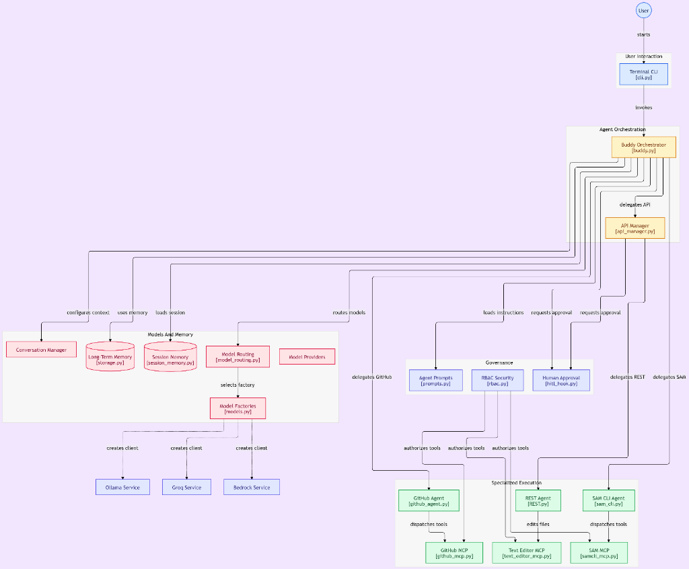

# Buddy Agent

Autonomous Pair Programming and Infrastructure Orchestration System

---

## Table of Contents

- [Overview](#overview)
- [System Architecture](#system-architecture)
- [Multi-Agent Topology](#multi-agent-topology)
- [Dynamic Model Routing and BYOM](#dynamic-model-routing-and-byom)
- [Model Context Protocol (MCP) Integration](#model-context-protocol-mcp-integration)
- [Memory Architecture and State Persistence](#memory-architecture-and-state-persistence)
- [Tactical HUD and System Telemetry](#tactical-hud-and-system-telemetry)
- [Governance, Security, and Human Approval](#governance-security-and-human-approval)
- [Engineering and Model Stack](#engineering-and-model-stack)
- [Installation and Quickstart](#installation-and-quickstart)
- [CLI Reference](#cli-reference)
- [Project Structure](#project-structure)
- [Environment Configuration](#environment-configuration)

---

## Overview

Buddy Agent is an autonomous pair programming and cloud infrastructure management system built on Python 3.14 and the Strands Agents framework. It automates full-lifecycle backend engineering tasks by delegating work across a hierarchy of specialized agents:

- **Multi-Agent Orchestration**: A central orchestrator coordinates task delegation to domain-specific micro-agents for API design, code patching, source control, and cloud infrastructure deployments.
- **Per-Agent Model Routing**: Supports independent LLM allocation per agent across Groq Cloud LPUs, local Ollama open weights, AWS Bedrock, or custom user-supplied models (Bring Your Own Model).
- **Model Context Protocol (MCP)**: Communicates with local and remote developer tools using standardized Model Context Protocol clients for GitHub, AWS SAM CLI, and atomic file editing.
- **State and Memory Persistence**: Multi-tier memory architecture combining session archiving, UUID hot-swapping, sliding window context compression, and vector-indexed long-term storage via AWS Bedrock Knowledge Bases.
- **Tactical Terminal HUD**: A retro night-vision terminal interface featuring real-time resource tracking, Braille CPU load curves, RSS memory meters, network throughput monitoring, and background task scanning.

---

## System Architecture

The following diagram illustrates the component topology, delegation flows, memory layers, and MCP tool execution paths within Buddy Agent:

<div align="center">



</div>

### Architectural Layers

1. **User Interaction Layer**: Accepts user prompts through the terminal CLI (`cli.py`), supporting interactive shell sessions, one-shot commands, automated missions, and telemetry monitors.
2. **Agent Orchestration Layer**: The Buddy Orchestrator (`buddy.py`) classifies incoming intent, formulates execution plans, and delegates discrete subtasks to specialized micro-agents.
3. **Specialized Execution Layer**: Contains domain-specific agents (`API Manager`, `REST Agent`, `GitHub Agent`, `SAM CLI Agent`) configured with targeted prompt instructions and bounded toolsets.
4. **Tool Context Protocol (MCP) Layer**: Standalone MCP client wrappers communicating over stdio to provide deterministic control over Git repositories, AWS CloudFormation / SAM CLI stacks, and local file systems.
5. **Models and Memory Layer**: Dynamic model routing engine, session state serialization to disk or S3, sliding-window conversation management, and vector-indexed knowledge bases.
6. **Governance and Security Layer**: Role-based tool access controls (RBAC) and human-in-the-loop (HITL) confirmation hooks for destructive operations.

---

## Multi-Agent Topology

Buddy Agent structures agent execution into a clean hierarchy to avoid monolithic context bloat and ensure precise execution:

```text
Buddy Orchestrator (Master Planner & Intent Classifier)
 ├── API Manager (REST Route Design & Schema Architect)
 │    └── REST Agent (FastAPI Endpoint Generator & File Editor)
 ├── GitHub Agent (Issue Management, PR Lifecycles & Branch Sync)
 └── SAM CLI Agent (Serverless Packaging, Validation & Cloud Deployment)
```

### Agent Roles and Responsibilities

| Agent | Module | Primary Responsibilities | Tools / MCP Used |
| :--- | :--- | :--- | :--- |
| **Buddy Orchestrator** | `buddy/buddy.py` | Top-level intent classification, multi-phase plan generation, context routing, and agent delegation. | `call_api_manager`, `call_sam_cli_agent`, `call_github_agent` |
| **API Manager** | `agent/services/api_manager.py` | Designs REST endpoints, validates route structures, and generates strict Pydantic schemas. | `call_rest_agent` |
| **REST Agent** | `agent/services/api_agent/REST.py` | Implements FastAPI endpoints and performs atomic file operations. | `Text Editor MCP`, `GitHub REST MCP` |
| **GitHub Agent** | `agent/services/github_agent.py` | Automates Git operations, commits, branch management, issue tracking, and pull request reviews. | `GitHub MCP` |
| **SAM CLI Agent** | `agent/services/local_deploy_agent/sam_cli.py` | Builds, packages, validates, and deploys serverless CloudFormation templates to AWS. | `SAM CLI MCP`, `Text Editor MCP` |

---

## Dynamic Model Routing and BYOM

Buddy Agent includes a dynamic model routing engine that allows users to assign different AI models to individual agents in the topology.

### Supported Model Catalogs

| Provider | Default Model | Predefined Models | BYOM Format |
| :--- | :--- | :--- | :--- |
| **Groq Cloud** | `qwen/qwen3.8-27b` | • `qwen/qwen3.8-27b`<br>• `openai/gpt-oss-120b`<br>• `meta-llama/llama-prompt-guard-2-22m` | `groq:<custom-model-id>` |
| **Ollama Local** | `llama3.1:8b` | • `llama3.1:8b`<br>• `qwen:7b`<br>• `qwen2.5-coder:32b` | `ollama:<custom-model-id>` |
| **AWS Bedrock** | `Claude 3.7 Sonnet` | • `us.anthropic.claude-3-7-sonnet-20250219-v1:0` | `bedrock:<custom-model-id>` |

### Independent Model Assignment

Users can customize model assignments per agent based on workload characteristics:
- **Buddy Orchestrator**: `Groq Cloud: Qwen 3.8 27B` (High-speed intent classification and workflow routing)
- **REST API Agent**: `Ollama Local: Qwen 2.5 Coder 32B` (Accurate code syntax and schema implementation)
- **GitHub Agent**: `Groq Cloud: GPT-OSS 120B` (Context-heavy PR and issue analysis)
- **SAM CLI Agent**: `AWS Bedrock: Claude 3.7 Sonnet` (Complex CloudFormation infrastructure management)

---

## Model Context Protocol (MCP) Integration

All system interactions are executed through standardized Model Context Protocol (MCP) clients with zero hardcoded tools:

| GitHub MCP Tools | SAM CLI MCP Tools | Text Editor MCP Tools |
| :--- | :--- | :--- |
| • `create_pull_request` | • `sam deploy` | • `create_or_update_file` |
| • `merge_pull_request` | • `sam sync` | • `replace_file_content` |
| • `create_issue` | • `sam delete` | • `multi_replace_file_content` |
| • `list_issues` | • `sam package` | • `delete_text_file_contents` |
| • `get_issue` | • `sam validate` | • `undo_text_file_contents` |
| • `update_issue` | • `sam logs` | • `view_file_contents` |
| • `add_issue_comment` | • `sam list` | • `list_directory_contents` |
| • `create_branch` | • `sam pipeline init` | • `move_text_file` |
| • `list_branches` | • `sam traces` | • `copy_text_file` |
| • `create_commit` | • `sam init` | |
| • `fork_repository` | | |

---

## Memory Architecture and State Persistence

Buddy Agent implements a dual-tier persistence strategy designed for deterministic, repeatable workflows:

1. **Session UUID Memory (`FileSessionManager` / `S3SessionManager`)**:
   - Each session is tracked by a unique UUID.
   - Message histories, token usage metrics, model configurations, and sub-agent model mappings are stored locally in `./agent/memory/sessions_data/session_<UUID>/session.json` or in Amazon S3.
   - Previous sessions can be resumed at any point by passing or pasting the UUID.
2. **Safe Sliding Window Compression**:
   - `SafeSlidingWindowConversationManager` compresses older conversation turns while safeguarding system guardrails, active tool definitions, and essential metadata from context window overflows.
3. **Long-Term Vector Memory**:
   - Connects to **AWS Bedrock Knowledge Bases** for semantic retrieval of historic project context and architectural patterns across sessions.

---

## Tactical HUD and System Telemetry

The terminal interface combines a retro Project I.G.I. navigation HUD with live system resource telemetry:

- **Btop++ System Telemetry**:
  - Live per-core CPU load curves rendered via Unicode Braille characters (`⣾`, `⣽`, `⣿`).
  - Memory consumption breakdown (RSS, shared, swap) and network throughput monitoring.
  - Interactive process viewer with real-time inspection.
  - 360-degree radar visualizer scanning active background threads and task workers.
- **Tactical Navigation**:
  - Tabbed configuration screen for AI models, session management, HUD color palettes (Phosphor Green, Matrix, Tokyo Night, Dracula, Catppuccin), and radar update intervals.

---

## Governance, Security, and Human Approval

- **Human-in-the-Loop (HITL) Confirmation Hook (`hitl_hook.py`)**: Automatically pauses execution and requests explicit human confirmation before executing high-risk or destructive actions (such as file removals, stack deletions, or git branch merges).
- **Role-Based Access Control (RBAC)**: Enforces permission boundaries across tools to ensure sub-agents only invoke tools relevant to their designated operational scope.
- **Distributed Observability**: Integrates OpenTelemetry and LangSmith tracing to capture complete execution graphs, prompt latencies, token consumption, and tool outcomes.

---

## Engineering and Model Stack

The system architecture and interface were engineered using modern foundation models aligned with specific task requirements:

- **Interface Design and Visual HUD**: Built using **Gemini 3.7 Flash** for high-throughput UI generation, palette rendering, and interactive terminal component design.
- **System Architecture and Complex Multi-Agent Orchestration**: Built using **Gemini 3.7** for complex reasoning, multi-agent protocol design, state persistence mechanics, and MCP client integrations.

---

## Installation and Quickstart

### Prerequisites

- **Python**: `>= 3.14`
- **Package Manager**: [`uv`](https://github.com/astral-sh/uv) (recommended) or `pip`
- **Ollama** (optional, for local inference): [https://ollama.com](https://ollama.com)

### 1. Clone and Install Dependencies

```bash
git clone https://github.com/BenjaminVijayaraj5102004/Buddy-agent.git
cd Buddy-agent

# Install dependencies with uv
uv sync
```

### 2. Configure Environment Variables

Create a `.env` file from `.env.example`:

```bash
cp .env.example .env
```

Populate the required credentials:

```env
# GitHub Configuration
GITHUB_PAT="your-github-personal-access-token"

# Ollama Configuration
OLLAMA_BASE_URL="http://localhost:11434"
OLLAMA_MODEL_ID="llama3.1:8b"

# Groq Configuration
GROQ_API_KEY="your-groq-api-key"
GROQ_MODEL_ID="qwen/qwen3.8-27b"

# AWS Configuration (Optional)
AWS_REGION="us-east-1"
BEDROCK_MODEL_ID="us.anthropic.claude-3-7-sonnet-20250219-v1:0"
```

### 3. Running Buddy Agent

#### Launch Tactical Terminal HUD
```bash
uv run python cli-terminal/cli.py
```

#### Launch Interactive CLI Runner
```bash
uv run python -m buddy.buddy
```

#### Execute One-Shot Task
```bash
uv run python cli-terminal/cli.py ask "Create a POST /items endpoint using FastAPI and python framework"
```

---

## CLI Reference

| Command | Category | Description |
| :--- | :--- | :--- |
| `cli.py` / `/menu` | Interface | Launches the Project I.G.I. tactical HUD menu and options dashboard |
| `/tools` / `tool_list` | Governance | Lists active MCP tools across GitHub, SAM CLI, and Text Editor |
| `/top` / `/monitor` | Telemetry | Launches full-screen Btop++ live system resource and radar monitor |
| `/model` / `/models` | AI Satellite | Opens multi-agent model matrix dialog to configure models per agent |
| `/session` | Memory | Displays stored session archive, paste UUID, or switch session context |
| `/demo` | Mission | Executes an automated FastAPI endpoint scaffolding demonstration |
| `/help` | Manual | Displays the tactical command manual and keyboard shortcuts |
| `/clear` / `cls` | Display | Clears the terminal screen and redraws the HUD banner |
| `/exit` / `quit` / `q` | System | Saves active session state and exits cleanly |

---

## Project Structure

```text
buddy-agent/
├── agent/                          # Agent Architecture and Governance
│   ├── config/                     # Pydantic configuration schemas
│   ├── guardrils/                  # System prompts, guardrails, and security policies
│   ├── hooks/                      # Human-in-the-loop (HITL) approval hooks
│   ├── mcp/                        # Model Context Protocol clients (GitHub, SAM, Text Editor)
│   ├── memory/                     # Session memory and long-term vector storage
│   │   ├── session_memory/         # Local file and S3 session persistence
│   │   ├── longterm_memory/        # AWS Bedrock Knowledge Base vector store
│   │   └── conversation_manager.py # Safe sliding window context managers
│   ├── model/                      # Dynamic model routing and provider factories
│   │   ├── groq_model.py           # Custom Groq async streaming implementation
│   │   ├── model_routing.py        # Model catalogs and BYOM routing engine
│   │   └── models.py               # Model factory abstractions
│   ├── services/                   # Specialized sub-agent services
│   │   ├── api_agent/REST.py       # REST API implementation agent
│   │   ├── api_manager.py          # API Manager orchestrator
│   │   ├── github_agent.py         # GitHub workflow automation agent
│   │   └── local_deploy_agent/     # AWS SAM CLI deployment agent
│   ├── skills/                     # Domain skill packs
│   └── trace/                      # OpenTelemetry and LangSmith tracing
├── assets/                         # Documentation assets and diagrams
│   └── architecture.png            # System architecture diagram
├── buddy/                          # Orchestrator Module
│   └── buddy.py                    # Master Buddy Agent and CLI runner
├── cli-terminal/                   # Tactical HUD Interface
│   ├── cli.py                      # Typer CLI entrypoint
│   └── ui/                         # Rich + Prompt-Toolkit UI engine
│       ├── menu.py                 # HUD menu and configuration options
│       ├── monitor.py              # Btop++ live braille graphs and radar
│       ├── dialogs.py              # Model matrices and session dialogs
│       ├── repl.py                 # Interactive tactical chat shell
│       ├── state.py                # Session state and multi-agent model manager
│       └── theme.py                # Night-vision and terminal color palettes
├── pyproject.toml                  # Python project metadata and dependencies
└── README.md                       # System documentation
```

---

## Environment Configuration

| Variable | Description | Default |
| :--- | :--- | :--- |
| `GROQ_API_KEY` | API Key for Groq Cloud LPUs | `""` |
| `GROQ_MODEL_ID` | Default Groq model identifier | `"qwen/qwen3.8-27b"` |
| `OLLAMA_BASE_URL` | Ollama HTTP daemon endpoint | `"http://localhost:11434"` |
| `OLLAMA_MODEL_ID` | Default Ollama model identifier | `"llama3.1:8b"` |
| `BEDROCK_MODEL_ID` | Default AWS Bedrock model identifier | `"us.anthropic.claude-3-7-sonnet-20250219-v1:0"` |
| `GITHUB_PAT` | GitHub Personal Access Token for GitHub MCP | `""` |
| `AWS_REGION` | AWS Region for Bedrock and SAM Deployments | `"us-east-1"` |
| `LANGSMITH_TRACING`| Enable OpenTelemetry tracing in LangSmith | `false` |
| `AWS_S3_SESSION_BUCKET_NAME` | S3 bucket for cloud session persistence | `""` |

---

<div align="center">

Project Buddy Agent

</div>
